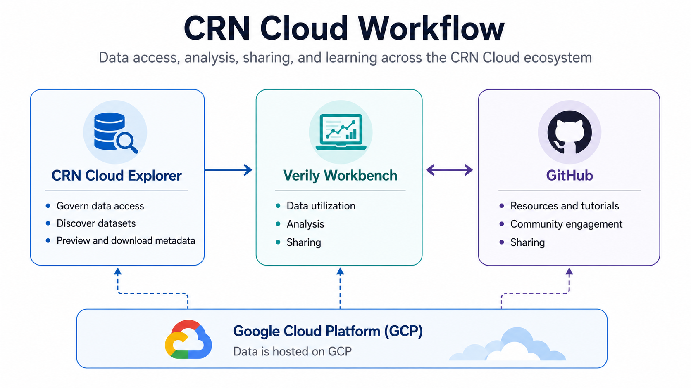

# What is the CRN Cloud?

The **CRN Cloud** is a data-sharing platform created by **Aligning Science Across Parkinson’s (ASAP)** that enables researchers worldwide to discover, access, analyze, and share Parkinson’s disease ‘omics data generated by CRN teams.

Three ideas are worth knowing before anything else:

- **You can browse before applying for access.** You don't need an approved application to review dataset descriptions and harmonized collections on the **[CRN Cloud Explorer](https://cloud.parkinsonsroadmap.org/collections)**.
- **Analyze data in the cloud** with Verily Workbench. Analyze large-scale omics data in a secure cloud environment, no local setup required.
- **Processed outputs for faster discovery**. Move from data access to insight more quickly using curated, analysis-ready resources.

## Recap: How the pieces fit together

| Pillar | Platform | What it's for |
|---|---|---|
| **Data Discovery** | CRN Cloud Explorer | Browse collections, review metadata, and apply for data access |
| **Data Utilization: Analysis & Sharing** | Verily Workbench | Analyze approved data, run notebooks and pipelines, collaborate |
| **Resources & Documentation** | GitHub | Tutorials, workshops, pipeline code, and community contribution |

All three sit on **Google Cloud Platform**, which hosts the data and handles backend access control underneath everything above.

!!! note "A note on naming"
    "CRN Cloud" is the umbrella name for the whole ecosystem — but you'll also hear "**CRN Cloud Explorer**" used specifically for the discovery/browsing tool (the first pillar above). If someone says "log into CRN Cloud," they mean the Explorer.

## What's actually in it

Data in the CRN Cloud Explorer is organized into two kinds of collections:

- **Harmonized Collections** — data standardized across multiple CRN teams' points of commonality, so it can be analyzed together (e.g., the Postmortem-Derived Brain Sequencing collection).
- **Individual Datasets** — A contributed body of data and related outputs for a defined study or experiment by an individual CRN team.

## The typical path

1. **Browse & evaluate collections on the [CRN Cloud Explorer](https://cloud.parkinsonsroadmap.org/collections)**.
2. **Request data access** — a one-time, per-person application. See [Requesting Data Access](requesting-data-access.md).
3. **Explore metadata** in the CRN Cloud. Refer to the [Navigating the CRN Cloud Explorer Video](https://youtu.be/NfVw8UwM6PI?si=O6S-NufoHYQQJFmR).
4. **Analyze data** in Verily Workbench. See the [Verily Workbench Guide](../workbench/index.md).
4. **Learn and contribute** — tutorials, workshops, and pipeline code live on GitHub. Explore at [Contributing on GitHub](../github/index.md) and [Tutorials & Case Studies](../tutorials/index.md).

## Where to go next

| If you're trying to... | Go to |
|---|---|
| Get access to the data | [Requesting Data Access](requesting-data-access.md) |
| Set up your analysis environment | [Verily Workbench Guide](../workbench/index.md) |
| Fork a repo or contribute | [Contributing on GitHub](../github/index.md) |
| Learn by doing | [Tutorials & Case Studies](../tutorials/index.md) |
| Understand dataset/release versions | [CRN Cloud Rosetta Stone](../rosetta-stone/index.md) |