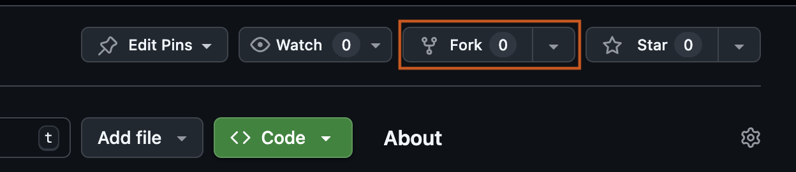

# Forking, Reusing, and Contributing to the Learning Lab

This page explains how teams can reuse the ASAP-CRN Learning Lab, link GitHub repositories to Verily Workbench workspaces, and contribute improvements back to the shared resources.

## Step 1: Get the Learning Lab Repository

There are two recommended ways to use the Learning Lab, depending on how much customization you need.

### Option A: Fork the Repository on Github (Recommended)
Forking creates your team’s own copy of the repository so you can customize notebooks, docs, and workflows without affecting the upstream Learning Lab.

1. Go to the Learning Lab repo on GitHub: 
   
    👉 [https://github.com/ASAP-CRN/asap-crn-learning-lab](https://github.com/ASAP-CRN/asap-crn-learning-lab)
2. Click **Fork** (top right)
    
3. Choose your organization or personal account as Owner of the forked repo. 
4. Click **Create fork**

    !!! note "Note" 
        For more information on forking a github repository, see the official [GitHub documentation on Forking](https://docs.github.com/en/pull-requests/collaborating-with-pull-requests/working-with-forks/fork-a-repo)

✅ Best for: 
    Teams that plan to modify notebooks, add new content, or maintain internal variants of the Learning Lab.

---
### Option B: Reuse without forking (minimal changes)
If you do not need to contribute changes back to the Learning Lab or need GitHub for version control, you can link the upstream repository directly in Verily Workbench.

- Cloning it locally, or
- Connecting it directly in Verily Workbench and using it as minimal reference

Any edits made in the workspace will persist within the app environment but will not be reflected in the source repository on GitHub.

✅ Best for: 
    Teams that want to explore, run, or lightly modify notebooks for their own analyses without maintaining a fork or contributing changes upstream.

## 2. Link GitHub Repositories to Verily Workbench Workspaces

Verily Workbench can automatically clone linked GitHub repositories into your cloud apps, allowing you to manage and run code directly in JupyterLab or other environments.

### Add a repository to your workspace
1. Open your workspace in Verily Workbench.
2. Go to the **Apps** tab.
3. Select **+ Add Repository**.
4. Fill in:
    - **Name**:** a short identifier (e.g., `learning-lab`)
    - **Repository URL:**
        - your fork repository URL 
        - or the upstream Learning Lab repository URL
5. Click **Add repository** to confirm.

Once added, the repository will be automatically cloned into your app environment when the app starts.

!!! note "Note"
If your workspace was created from the Learning Lab template, the repository may already be linked. If you don’t see it listed, you can add it manually using the steps above, or link your forked repository instead.

--- 
### Where the repo appears inside your app
After launching **JupyterLab** (or another app), your repositories typically show up under a directory like:

- `/repos/<repo-name>/...`

From there you can:

 - Open notebooks, 
 - Edit files
 - Run code directly in the environment

!!! note "Note"
If you do not see `/repos/` directory, restart your app or confirm the repository is linked in the **Apps → Repositories** section.

# Contributing back to the Learning Lab

We welcome contributions that improve the Learning Lab for the broader ASAP-CRN community, including bug fixes, documentation updates, and new or improved notebooks.
---

## Reporting Issues 
If you find a bug, unclear documentation, or have a suggestion:

1. Visit the Learning Lab GitHub repository
👉 [https://github.com/ASAP-CRN/asap-crn-learning-lab](https://github.com/ASAP-CRN/asap-crn-learning-lab)
2. Open a **New Issue** with a brief description and relevant context (file names, errors, screenshots).

---
## Submitting Pull Requests 
To share improvements:
1. Fork the repository.
2. Create a new branch for your changes.
3. Make and test your updates.
4. Push to your fork and open a **Pull Request**.

Please include a short summary of what changed and why.

---
**Best Practices**
- Keep changes focused and small.
- Follow existing structure and naming conventions.
- Update documentation when adding new content.
- Ensure notebooks and code run end-to-end.
- Do not include sensitive or private data.

If changes are highly experimental or specific to internal work, we recommend keeping them in your fork rather than submitting a PR.