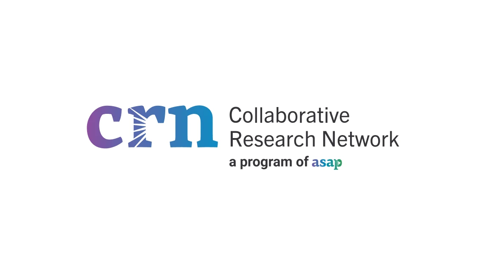

{ width="600" align="center" }

# ASAP CRN Learning Lab

Welcome to the **ASAP CRN Learning Lab**, a resource for working with **ASAP CRN (Aligning Science Across Parkinson’s Collaborative Research Network)** data on Verily Workbench.

This site offers a **progressive, modular learning path**: start at the beginning for a full onboarding experience, or dive directly into the sections most relevant to your work. You can access all tutorials and resources on the [asap-crn-learning-lab Github Repo](https://github.com/ASAP-CRN/asap-crn-learning-lab)

---

## Prerequisite: Data Access

Before you begin, make sure you have access to the **ASAP CRN data collections** on Verily Workbench. Access to these datasets is managed through the **Aligning Science Across Parkinson’s (ASAP)** data access system.

To request access:

1. Go to the portal below.  
🔗 [ASAP CRN Data Portal](https://cloud.parkinsonsroadmap.org/collections)
2. Click **Log In** in the upper right corner.  
3. Select any collection tile and choose **Apply for Access**. 
4. Fill out the application form with your appropriate information.

Once your request is approved, you will receive an email confirming that your account has been granted access to the available collections through the **ASAP CRN Cloud** and **Verily Workbench**.

!!! warning "Access required"
    You will not be able to use ASAP CRN data or workspaces until your data access request has been approved.

For detailed instructions on the access process, see the  
📘 [ASAP CRN Cloud User Manual (PDF)](https://storage.googleapis.com/asap-public-assets/wayfinding/ASAP-CRN-Cloud-User-Manual.pdf)

---

## Start Here

1. **Read the Starter Guide**  
   Begin with [Getting Started](getting-started.md) to learn how to connect to Verily Workbench and set up your workspace.

2. **Choose Your Path**  
    - **[Pilot Workshop Series](https://github.com/ASAP-CRN/asap-crn-learning-lab/tree/main/tutorials/00_pilot_workshop_series)** (3 parts) – a hands-on introduction to using Verily Workbench and performing an analysis with an example dataset.  
    -*coming soon!*  **Case Studies** – curated examples that illustrate applied workflows and data-driven insights.

---
!!! note "Data access"
    This site does not distribute ASAP CRN data.  Access is managed through the [ASAP CRN Data Portal](https://cloud.parkinsonsroadmap.org/collections).  
    For access steps, see [Prerequisite: Data Access](#prerequisite-data-)
